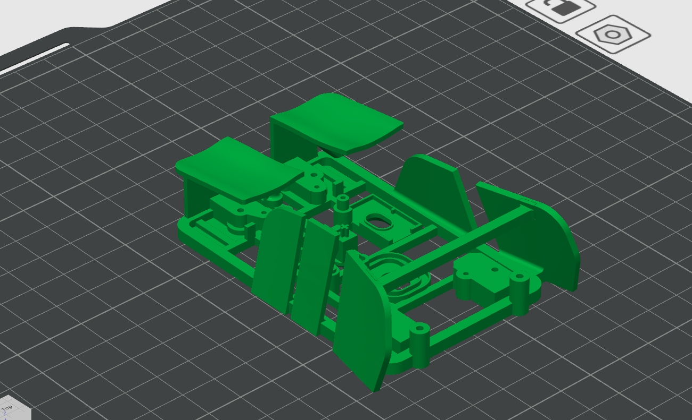

<h1 align="center">
      <!-- logo credit: https://www.vexels.com/png-svg/preview/325937/blue-computer-mouse-icon -->
      

ZeroWire

  

            
            

</h1>

**ZeroWire** is a custom-built wireless USB HID mouse featuring USB-C charging[^1] and a 2.4GHz radio-based transceiver/receiver system[^2].

ZeroWire is the successor of Infinitywire, a mouse supporting a higher quality shell, a better sensor[^3], supporting wireless connectivity.

## **Components Used**
- Razer Viper V2 Pro
- 3D printed shell
- MX Anywhere 2 PCB
- Tiger Ice V2 Dot Skates
- 3.7V 1000mAh Lipo Battery + TP4056 Charger Module
- TTC 80M Switch (x2)
- Jumper Wires
- 12V Multimeter

## **Project Outline:**
> [!NOTE]
> **Note:** Two mice will be created. One will be a wireless mouse using 2.4Ghz RF and USB-C and one will be a wired mouse using Micro-USB.
- Custom breakout board PCB for PAW3395 ordered (credit to [ufan's breakout board](https://github.com/ufan/paw3395_pmw3361_breakout))
- [KiCAD](https://www.kicad.org/download/windows/) used to review PCB and schematic
- Custom Razer Viper V2 / Zeromouse V35 shell .stl downloaded and reviewed in [TinkerCAD](https://www.tinkercad.com/dashboard) and [Bambu Studio](https://bambulab.com/en/download/studio) (can be downloaded [here](https://www.printables.com/model/979182-lightweight-zeromouse-inspired-logitech-mx-mouse-m/files) or in [/files](https://github.com/aparkgh/zerowire/blob/main/files/Mouse%20Mod%20Final%20V1.stl)) NEEDS UPDATE!!!
- Zeromouse V35 Shell printed at Craftcloud

> [!NOTE]
> **Note:** Model photos need update!

Top | Back + Left | Front + Right
:-:|:-:|:-:
 |  | 

## **Useful Links:**
- [Pricesheet](https://1drv.ms/x/c/81566783f4b27a85/Eb886e1THZZElGMRDwNFMZEBl47CX9LvK6eldiMpxhTBGg?e=1K7VTB)

## **Things that went well:**
- AliExpress offers a wide range of electronic components at relatively low prices, making it a great resource for budget-conscious projects. The caveat, however, is the longer shipping times, which can delay progress if not planned for in advance.

## **Complications:**
- needs update

## **Acknowledgements**
This project would not have been possible without the support of the following people and organisations:
- Ali ([@optimumtech](https://www.youtube.com/@optimumtech)), for inspiring the project idea and the mouse shell design.
- Andrew ([@rudh](https://www.printables.com/@rudh)), for designing the mouse shell 3D model. NEEDS UPDATE!!
- Craftcloud ([USYD](https://www.sydney.edu.au/)), for offering extremely detailed and high quality 3D printing.
- [ChatGPT](https://chatgpt.com/), for assistance with general project management.
- [AliExpress](https://www.aliexpress.com/) and [eBay](https://www.ebay.com.au/), for providing affordable electronic components.

[^1]: USB-C is reversible, supports higher USB versions and power delivery, offers greater durability, and enables faster data transfer. While USB-C boards are generally more expensive than Micro USB, the cost difference is negligible and justified by the enhanced feature set.
[^2]: Bluetooth pairing is slightly more power-efficient and doesn’t require a dongle, and it also operates on the 2.4GHz frequency. However, using 2.4GHz RF (proprietary wireless) offers significantly lower latency (typically reduced from 100–200 ms to around 1 ms), a longer connection range, and simpler pairing for dedicated use cases.
[^3]: Pixart's PAW3395DM-T6QU has 26,000 max DPI/CPI, a 650 IPS max tracking speed, and 50G of max accleration. This falls slightly behind the compared to Razer's Focus Pro 30K, which sports a 30,000 max DPI/CPI, a 750IPS max tracking speed, and 60G of max acceleration, with the addition of supporting [Smart Tracking](https://www.razer.com/au-en/razer-focus-plus-sensor#:~:text=With%20Smart%20Tracking%2C%20the%20Razer,%E2%80%94and%20accuracy%E2%80%94remains%20consistent.) and [Asymmetric Cut-Off](https://www.razer.com/au-en/razer-focus-plus-sensor#:~:text=On%20top%20of%20the%20sensor's,your%20mouse%20touches%20the%20surface.).
