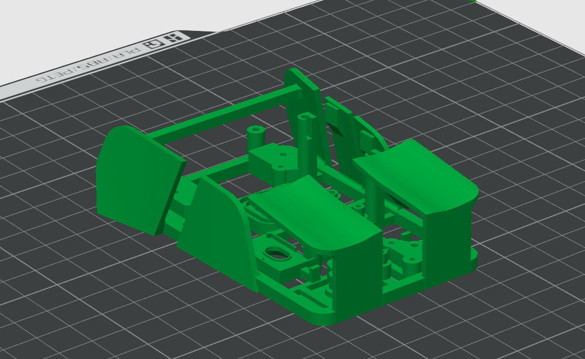

<h1 align="center">
      <!-- logo credit: https://www.vexels.com/png-svg/preview/325937/blue-computer-mouse-icon -->
      

ZeroWire

  

            
            

</h1>

**ZeroWire** is a custom-built wireless USB HID mouse featuring USB-C charging[^1] and a 2.4GHz radio-based transceiver/receiver system[^2].

## **Components Used**
> [!NOTE]
> **Note:** A multimeter is required to tune the DC boost converter to 5V.
- Raspberry Pi Pico (USB-C)
- PixArt PAW3395DM-T6QU Optical Sensor
- NRF24L01 Transceiver + CH340 USB Receiver
- MT3608 2-24V to 5V DC Boost Converter
- 3.7V 1000mAh Lipo Battery + TP4056 Charger Module
- Omron D2F-01L Switch (x2)
- Jumper Wires
- 12V Multimeter

### 1. **Component Configuration**

## **Steps taken:**
- Custom breakout board pcb for PAW3395 ordered (credit to [ufan's breakout board](https://github.com/ufan/paw3395_pmw3361_breakout))
- [KiCAD](https://www.kicad.org/download/windows/) used to review PCB and schematic
- Raspberry Pi Pico mounted (BOOTSEL) and .uf2 file uploaded (easier programming, can be downloaded [here](https://www.raspberrypi.com/documentation/microcontrollers/micropython.html) or in [/files](https://github.com/aparkgh/zerowire/blob/main/files/RPI_PICO-20241129-v1.24.1.uf2))
- [Thonny](https://thonny.org/) used to upload nrf24l01.py driver (for wireless transceiver, can be downloaded [here](https://github.com/micropython/micropython-lib/tree/master/micropython/drivers/radio/nrf24l01) or in [/files](https://github.com/aparkgh/zerowire/blob/main/files/nrf24l01.py))
- ufan's breakout board layered in between sensor and LM19-LSI lens
- Shell file downloaded and reviewed in [TinkerCAD](https://www.tinkercad.com/dashboard) and [Bambu Studio](https://bambulab.com/en/download/studio) (can be downloaded [here](https://www.printables.com/model/979182-lightweight-zeromouse-inspired-logitech-mx-mouse-m/files) or in [/files](https://github.com/aparkgh/zerowire/blob/main/files/Mouse%20Mod%20Final%20V1.stl))

Top | Back + Left | Front + Right
:-:|:-:|:-:
 |  | 

## **Useful Links:**
- [NRF24L01 Pinout](https://howtomechatronics.com/wp-content/uploads/2017/02/NRF24L01-Pinout-NRF24L01-PA-LNA-.png)
- [Raspberry Pi Pico Pinout](https://www.raspberrypi.com/documentation/microcontrollers/images/pico-pinout.svg)
- [Pricesheet](https://1drv.ms/x/c/81566783f4b27a85/Eb886e1THZZElGMRDwNFMZEBl47CX9LvK6eldiMpxhTBGg?e=1K7VTB)

## **Things that went well:**
- AliExpress offers a wide range of electronic components at relatively low prices, making it a great resource for budget-conscious projects. The caveat, however, is the longer shipping times, which can delay progress if not planned for in advance.

## **Complications:**
- With almost no prior knowledge of the components or MicroPython, I turned to online guides to build a foundational understanding. I deliberately avoided YouTube tutorials and refrained from copying existing projects, choosing instead to learn and problem-solve through building a unique solution from scratch. Once I had a basic grasp of the system, I created a UML diagram to map how all the components would be wired together. Additionally, I maintained an Excel price sheet to track all expenses, ensuring that anyone looking to replicate the project would have a clear understanding of the total cost involved.
- Mounting the Raspberry Pi Pico via BOOTSEL mode requires a USB cable that supports data transfer. Unbeknownst to me at the time, most of the cables I owned were charge-only, with only one capable of transferring data. This initially led to confusion during setup, as the Pico wasn’t being detected by my computer.
- Midway through the project, I found that I needed to find a custom PCB for the PAW3395 sensor, as it requires a breakout board to sit between the sensor and the lens for proper alignment and functionality. This involved sourcing a compatible PCB design and then finding a manufacturer who could print and ship it affordably, adding another layer of complexity to the build.
- Obtaining the datasheet for the sensor proved more challenging than expected. To retrieve movement data, I needed to initialize SPI communication between the sensor and the Raspberry Pi Pico. However, the technical details required for this process—such as the SPI initialization sequence and power-on procedure—were only available in the official datasheet. Since the document is confidential, I had to contact PixArt directly, sign a non-disclosure agreement (NDA), and as a result, I am unable to publicly share its contents, which include critical information like assembly guidelines and schematic references.

## **Acknowledgements**
This project would not have been possible without the support of the following people and organisations:
- Ali ([@optimumtech](https://www.youtube.com/@optimumtech)), for inspiring the project idea and the mouse shell design.
- Andrew ([@rudh](https://www.printables.com/@rudh)), for designing the mouse shell 3D model.
- Zhou ([@ufan](https://github.com/ufan)), for designing the custom PCB.
- PixArt, for supply and guidance on sensor configuration.
- The University of Sydney (USYD), for offering free 3D printing and consultation services.
- ChatGPT, for assistance with general project management.
- AliExpress and eBay, for providing affordable electronic components.

[^1]: USB-C is reversible, supports higher USB versions and power delivery, offers greater durability, and enables faster data transfer. While USB-C boards are generally more expensive than Micro USB, the cost difference is negligible and justified by the enhanced feature set.
[^2]: Bluetooth pairing is slightly more power-efficient and doesn’t require a dongle, and it also operates on the 2.4GHz frequency. However, using 2.4GHz RF (proprietary wireless) offers significantly lower latency (typically reduced from 100–200 ms to around 1 ms), a longer connection range, and simpler pairing for dedicated use cases.
